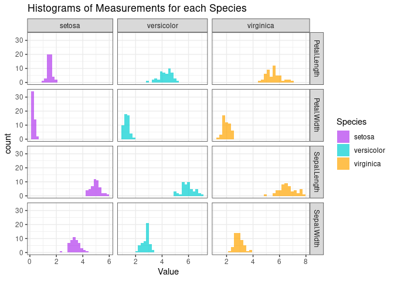

# Packages and data

    library(ggplot2)
    library(viridis)

    ## Loading required package: viridisLite

    library(hrbrthemes)
    library(tidyr)

    data("iris")

# Boxplots

## Violin Boxplot

    iris %>%
      ggplot( aes(x = Species, y = Sepal.Length, fill = Species)) +
        geom_violin() +
        scale_fill_viridis(discrete = TRUE, alpha = 0.6, option = "A") +
        theme_ipsum() +
        theme(
          legend.position = "none",
          plot.title = element_text(size = 11)
        ) +
        ggtitle("Violin Boxplot for Sepal.Length of iris") +
        xlab("")

## Standard Boxplot

    iris %>%
      ggplot( aes(x = Species, y = Sepal.Length, fill = Species)) +
           geom_boxplot() +
        scale_fill_viridis(discrete = TRUE, alpha = 0.8) +
        geom_jitter(color="black", size = 0.5, alpha = 1) +
        theme_ipsum() +
        theme(
          legend.position="none",
          plot.title = element_text(size=14)
        ) +
        ggtitle("Boxplot for Sepal.Length of iris") +
        xlab("Species")

# Histogram and density

    iris_long <- iris %>%
      pivot_longer(cols = c(Sepal.Length, Sepal.Width, Petal.Length, Petal.Width),
                   names_to = "Measurement", values_to = "Value")

    ggplot(iris_long, aes(x = Value, fill = Species)) +
      geom_histogram(alpha = 0.7, position = "identity", bins = 30) +
      facet_grid(Measurement ~ Species, scales = "free_x", space = "free") +  
      theme_bw() +
      scale_fill_manual(values = c("darkorchid2", "darkturquoise", "orange")) +
      ggtitle("Histograms of Measurements for each Species")

    ggplot(iris_long, aes(x = Value, fill = Species)) +
      geom_density(alpha = 0.7, position = "identity", bins = 30) +
      facet_grid(Measurement ~ Species, scales = "free_x", space = "free") +  
      theme_bw() +
      scale_fill_manual(values = c("darkorchid2", "darkturquoise", "orange")) +
      ggtitle("Density of Measurements for each Species")

    ## Warning in geom_density(alpha = 0.7, position = "identity", bins = 30):
    ## Ignoring unknown parameters: `bins`

