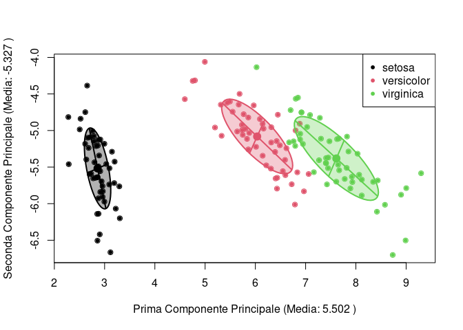
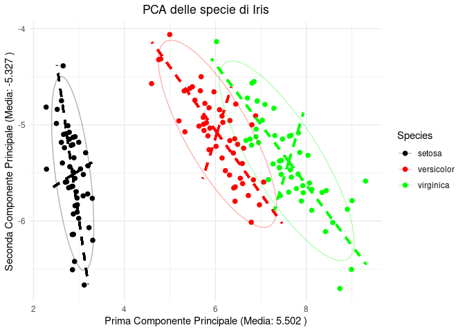

    library(car)

    ## Loading required package: carData

    library(ggplot2)
    library(GGally)

    ## Registered S3 method overwritten by 'GGally':
    ##   method from   
    ##   +.gg   ggplot2

    data("iris")
    matrice_iris <- as.matrix(iris[, 1:4])

    medie <- apply(matrice_iris, 2, mean)

    mat_centrata <- sweep(matrice_iris, 2, medie)

    mat_var_cov <- (1/(nrow(matrice_iris)-1)) * t(mat_centrata) %*% mat_centrata

    sd <- sqrt(diag(mat_var_cov))

    mat_sd <- diag(1/sd)

    corr <- mat_sd %*% mat_var_cov %*% mat_sd

    corr

    ##            [,1]       [,2]       [,3]       [,4]
    ## [1,]  1.0000000 -0.1175698  0.8717538  0.8179411
    ## [2,] -0.1175698  1.0000000 -0.4284401 -0.3661259
    ## [3,]  0.8717538 -0.4284401  1.0000000  0.9628654
    ## [4,]  0.8179411 -0.3661259  0.9628654  1.0000000

    var(matrice_iris)

    ##              Sepal.Length Sepal.Width Petal.Length Petal.Width
    ## Sepal.Length    0.6856935  -0.0424340    1.2743154   0.5162707
    ## Sepal.Width    -0.0424340   0.1899794   -0.3296564  -0.1216394
    ## Petal.Length    1.2743154  -0.3296564    3.1162779   1.2956094
    ## Petal.Width     0.5162707  -0.1216394    1.2956094   0.5810063

    mat_var_cov

    ##              Sepal.Length Sepal.Width Petal.Length Petal.Width
    ## Sepal.Length    0.6856935  -0.0424340    1.2743154   0.5162707
    ## Sepal.Width    -0.0424340   0.1899794   -0.3296564  -0.1216394
    ## Petal.Length    1.2743154  -0.3296564    3.1162779   1.2956094
    ## Petal.Width     0.5162707  -0.1216394    1.2956094   0.5810063

    auto <- eigen(var(matrice_iris))
    primo <- auto$values[1]
    primovect <- auto$vectors[, 1]
    y_1 <- matrice_iris %*% primovect
    var(matrice_iris %*% primovect)

    ##          [,1]
    ## [1,] 4.228242

    y_2 <- matrice_iris %*% auto$vectors[, 2]

    media_prima <- mean(y_1)
    media_seconda <- mean(y_2)

    plot(y_1, y_2, col = c(as.numeric(as.factor(iris$Species))), pch = 20, 
          xlab = paste("Prima Componente Principale (Media:", round(media_prima, 3), ")"), 
          ylab = paste("Seconda Componente Principale (Media:", round(media_seconda, 3), ")"))

    legend("topright", legend = levels(iris$Species), col = 1:3, pch = 20)

    drawEllipseWithFullAxes <- function(x, y, col, level = 0.5) {
      
      dataEllipse(x, y, levels = level, add = TRUE, col = col, fill = TRUE)
      
      cov_matrix <- cov(cbind(x, y))
      
      eig <- eigen(cov_matrix)
      
      center <- c(mean(x), mean(y))
      
      radii <- sqrt(qchisq(level, df = 2)) * sqrt(eig$values)
      
      segments(center[1], center[2], 
               center[1] + radii[1] * eig$vectors[1, 1], 
               center[2] + radii[1] * eig$vectors[2, 1], 
               col = col, lwd = 2, lty = 1)  # Asse principale

      segments(center[1], center[2], 
               center[1] - radii[1] * eig$vectors[1, 1], 
               center[2] - radii[1] * eig$vectors[2, 1], 
               col = col, lwd = 2, lty = 1)  # Asse principale in direzione opposta

      segments(center[1], center[2], 
               center[1] + radii[2] * eig$vectors[1, 2], 
               center[2] + radii[2] * eig$vectors[2, 2], 
               col = col, lwd = 2, lty = 1)  # Asse secondario

      segments(center[1], center[2], 
               center[1] - radii[2] * eig$vectors[1, 2], 
               center[2] - radii[2] * eig$vectors[2, 2], 
               col = col, lwd = 2, lty = 1)  # Asse secondario in direzione opposta
    }

    drawEllipseWithFullAxes(y_1[iris$Species == "setosa"], y_2[iris$Species == "setosa"], col = 1)

    drawEllipseWithFullAxes(y_1[iris$Species == "versicolor"], y_2[iris$Species == "versicolor"], col = 2)
    drawEllipseWithFullAxes(y_1[iris$Species == "virginica"], y_2[iris$Species == "virginica"], col = 3)

Ora lo faccio con ggplot

    df_pca <- data.frame(
      PC1 = y_1,
      PC2 = y_2,
      Species = iris$Species
    )

    p <- ggplot(df_pca, aes(x = PC1, y = PC2, color = Species)) +
      geom_point(size = 2) +
      stat_ellipse(aes(fill = Species), level = 0.95, alpha = 0.3, linetype = "solid") +
      theme_minimal() +
      scale_fill_manual(values = c("setosa" = "black", "versicolor" = "red", "virginica" = "green")) +  # Colori delle ellissi
      scale_color_manual(values = c("setosa" = "black", "versicolor" = "red", "virginica" = "green")) +  
      labs(x = paste("Prima Componente Principale (Media:", round(mean(y_1), 3), ")"),
           y = paste("Seconda Componente Principale (Media:", round(mean(y_2), 3), ")"),
           title = "PCA delle specie di Iris") +
      theme(plot.title = element_text(hjust = 0.5))

    ## Warning in stat_ellipse(aes(fill = Species), level = 0.95, alpha = 0.3, :
    ## Ignoring unknown aesthetics: fill

    # Assi delle ellissi
    drawEllipseAxes <- function(data, color) {
      cov_matrix <- cov(cbind(data$PC1, data$PC2))
      eig <- eigen(cov_matrix)
      center <- colMeans(data[, c("PC1", "PC2")])
      radii <- sqrt(qchisq(0.95, df = 2)) * sqrt(eig$values)

      # Asse principale
      p <- p + geom_segment(aes(x = center[1], y = center[2],
                                 xend = center[1] + radii[1] * eig$vectors[1, 1],
                                 yend = center[2] + radii[1] * eig$vectors[2, 1]),
                            color = color, linetype = "dashed", size = 1)

      p <- p + geom_segment(aes(x = center[1], y = center[2],
                                 xend = center[1] - radii[1] * eig$vectors[1, 1],
                                 yend = center[2] - radii[1] * eig$vectors[2, 1]),
                            color = color, linetype = "dashed", size = 1)

      # Asse secondario
      p <- p + geom_segment(aes(x = center[1], y = center[2],
                                 xend = center[1] + radii[2] * eig$vectors[1, 2],
                                 yend = center[2] + radii[2] * eig$vectors[2, 2]),
                            color = color, linetype = "dashed", size = 1)

      p <- p + geom_segment(aes(x = center[1], y = center[2],
                                 xend = center[1] - radii[2] * eig$vectors[1, 2],
                                 yend = center[2] - radii[2] * eig$vectors[2, 2]),
                            color = color, linetype = "dashed", size = 1)

      return(p)
    }

    p <- drawEllipseAxes(df_pca[df_pca$Species == "setosa", ], "black")

    ## Warning: Using `size` aesthetic for lines was deprecated in ggplot2 3.4.0.
    ## ℹ Please use `linewidth` instead.
    ## This warning is displayed once every 8 hours.
    ## Call `lifecycle::last_lifecycle_warnings()` to see where this warning was
    ## generated.

    p <- drawEllipseAxes(df_pca[df_pca$Species == "versicolor", ], "red")
    p <- drawEllipseAxes(df_pca[df_pca$Species == "virginica", ], "green")

    p

    ## Warning in geom_segment(aes(x = center[1], y = center[2], xend = center[1] + : All aesthetics have length 1, but the data has 150 rows.
    ## ℹ Please consider using `annotate()` or provide this layer with data containing
    ##   a single row.

    ## Warning in geom_segment(aes(x = center[1], y = center[2], xend = center[1] - : All aesthetics have length 1, but the data has 150 rows.
    ## ℹ Please consider using `annotate()` or provide this layer with data containing
    ##   a single row.

    ## Warning in geom_segment(aes(x = center[1], y = center[2], xend = center[1] + : All aesthetics have length 1, but the data has 150 rows.
    ## ℹ Please consider using `annotate()` or provide this layer with data containing
    ##   a single row.

    ## Warning in geom_segment(aes(x = center[1], y = center[2], xend = center[1] - : All aesthetics have length 1, but the data has 150 rows.
    ## ℹ Please consider using `annotate()` or provide this layer with data containing
    ##   a single row.

    ## Warning in geom_segment(aes(x = center[1], y = center[2], xend = center[1] + : All aesthetics have length 1, but the data has 150 rows.
    ## ℹ Please consider using `annotate()` or provide this layer with data containing
    ##   a single row.

    ## Warning in geom_segment(aes(x = center[1], y = center[2], xend = center[1] - : All aesthetics have length 1, but the data has 150 rows.
    ## ℹ Please consider using `annotate()` or provide this layer with data containing
    ##   a single row.

    ## Warning in geom_segment(aes(x = center[1], y = center[2], xend = center[1] + : All aesthetics have length 1, but the data has 150 rows.
    ## ℹ Please consider using `annotate()` or provide this layer with data containing
    ##   a single row.

    ## Warning in geom_segment(aes(x = center[1], y = center[2], xend = center[1] - : All aesthetics have length 1, but the data has 150 rows.
    ## ℹ Please consider using `annotate()` or provide this layer with data containing
    ##   a single row.

    ## Warning in geom_segment(aes(x = center[1], y = center[2], xend = center[1] + : All aesthetics have length 1, but the data has 150 rows.
    ## ℹ Please consider using `annotate()` or provide this layer with data containing
    ##   a single row.

    ## Warning in geom_segment(aes(x = center[1], y = center[2], xend = center[1] - : All aesthetics have length 1, but the data has 150 rows.
    ## ℹ Please consider using `annotate()` or provide this layer with data containing
    ##   a single row.

    ## Warning in geom_segment(aes(x = center[1], y = center[2], xend = center[1] + : All aesthetics have length 1, but the data has 150 rows.
    ## ℹ Please consider using `annotate()` or provide this layer with data containing
    ##   a single row.

    ## Warning in geom_segment(aes(x = center[1], y = center[2], xend = center[1] - : All aesthetics have length 1, but the data has 150 rows.
    ## ℹ Please consider using `annotate()` or provide this layer with data containing
    ##   a single row.

