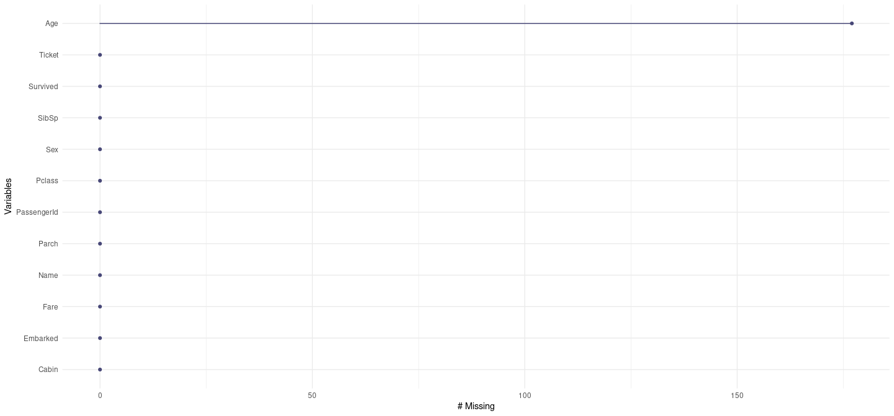

# Packages and dataset

    library(gtsummary)
    library(dplyr)

    ## 
    ## Attaching package: 'dplyr'

    ## The following objects are masked from 'package:stats':
    ## 
    ##     filter, lag

    ## The following objects are masked from 'package:base':
    ## 
    ##     intersect, setdiff, setequal, union

    library(ggplot2)
    library(viridis)

    ## Loading required package: viridisLite

    library(hrbrthemes)
    library(naniar)
    library(tidyr)
    library(pROC)

    ## Type 'citation("pROC")' for a citation.

    ## 
    ## Attaching package: 'pROC'

    ## The following objects are masked from 'package:stats':
    ## 
    ##     cov, smooth, var

    library(caret)

    ## Loading required package: lattice

    library(MASS)

    ## 
    ## Attaching package: 'MASS'

    ## The following object is masked from 'package:dplyr':
    ## 
    ##     select

    ## The following object is masked from 'package:gtsummary':
    ## 
    ##     select

    library(klaR)
    library(ranger)
    library(xgboost)

    ## 
    ## Attaching package: 'xgboost'

    ## The following object is masked from 'package:dplyr':
    ## 
    ##     slice

    library(e1071)
    library(nnet)
    library(missForest)

    data_train <- read.csv("~/Kaggle_Titanic/train.csv")
    data_test <- read.csv("~/Kaggle_Titanic/test.csv")
    gender_submission <- read.csv("~/Kaggle_Titanic/gender_submission.csv")
    head(data_train, 5)

    ##   PassengerId Survived Pclass
    ## 1           1        0      3
    ## 2           2        1      1
    ## 3           3        1      3
    ## 4           4        1      1
    ## 5           5        0      3
    ##                                                  Name    Sex Age SibSp Parch
    ## 1                             Braund, Mr. Owen Harris   male  22     1     0
    ## 2 Cumings, Mrs. John Bradley (Florence Briggs Thayer) female  38     1     0
    ## 3                              Heikkinen, Miss. Laina female  26     0     0
    ## 4        Futrelle, Mrs. Jacques Heath (Lily May Peel) female  35     1     0
    ## 5                            Allen, Mr. William Henry   male  35     0     0
    ##             Ticket    Fare Cabin Embarked
    ## 1        A/5 21171  7.2500              S
    ## 2         PC 17599 71.2833   C85        C
    ## 3 STON/O2. 3101282  7.9250              S
    ## 4           113803 53.1000  C123        S
    ## 5           373450  8.0500              S

    head(data_test, 5)

    ##   PassengerId Pclass                                         Name    Sex  Age
    ## 1         892      3                             Kelly, Mr. James   male 34.5
    ## 2         893      3             Wilkes, Mrs. James (Ellen Needs) female 47.0
    ## 3         894      2                    Myles, Mr. Thomas Francis   male 62.0
    ## 4         895      3                             Wirz, Mr. Albert   male 27.0
    ## 5         896      3 Hirvonen, Mrs. Alexander (Helga E Lindqvist) female 22.0
    ##   SibSp Parch  Ticket    Fare Cabin Embarked
    ## 1     0     0  330911  7.8292              Q
    ## 2     1     0  363272  7.0000              S
    ## 3     0     0  240276  9.6875              Q
    ## 4     0     0  315154  8.6625              S
    ## 5     1     1 3101298 12.2875              S

# Data description

**survival** Survival 0 = No, 1 = Yes

**pclass** Ticket class 1 = 1st, 2 = 2nd, 3 = 3rd: 1st = Upper; 2nd =
Middle; 3rd = Lower

**sex** Sex

**Age** Age in years: Age is fractional if less than 1. If the age is
estimated, is it in the form of xx.5

**sibsp** \# of siblings / spouses aboard the Titanic: The dataset
defines family relations in this way… Sibling = brother, sister,
stepbrother, stepsister Spouse = husband, wife (mistresses and fiancés
were ignored)

**parch** \# of parents / children aboard the Titanic: The dataset
defines family relations in this way… Parent = mother, father Child =
daughter, son, stepdaughter, stepson Some children travelled only with a
nanny, therefore parch=0 for them.

**ticket** Ticket number

**fare** Passenger fare

**cabin** Cabin number

**embarked** Port of Embarkation C = Cherbourg, Q = Queenstown, S =
Southampton

    data_train <- data_train %>%
      mutate(across(c(Survived, Pclass, Sex, Embarked), as.factor))

    data_test <- data_test %>%
      mutate(across(c(Pclass, Sex, Embarked), as.factor))

    tbl_summary(data_train, include = c(Survived, Pclass, Sex, SibSp, Parch, Embarked))

<table class="gt_table" data-quarto-disable-processing="false" data-quarto-bootstrap="false">
  <thead>
    <tr class="gt_col_headings">
      <th class="gt_col_heading gt_columns_bottom_border gt_left" rowspan="1" colspan="1" scope="col" id="label"><strong>Characteristic</strong></th>
      <th class="gt_col_heading gt_columns_bottom_border gt_center" rowspan="1" colspan="1" scope="col" id="stat_0"><strong>N = 891</strong>1</th>
    </tr>
  </thead>
  <tbody class="gt_table_body">
    <tr><td headers="label" class="gt_row gt_left">Survived</td>
<td headers="stat_0" class="gt_row gt_center"> </td></tr>
    <tr><td headers="label" class="gt_row gt_left">    0</td>
<td headers="stat_0" class="gt_row gt_center">549 (62%)</td></tr>
    <tr><td headers="label" class="gt_row gt_left">    1</td>
<td headers="stat_0" class="gt_row gt_center">342 (38%)</td></tr>
    <tr><td headers="label" class="gt_row gt_left">Pclass</td>
<td headers="stat_0" class="gt_row gt_center"> </td></tr>
    <tr><td headers="label" class="gt_row gt_left">    1</td>
<td headers="stat_0" class="gt_row gt_center">216 (24%)</td></tr>
    <tr><td headers="label" class="gt_row gt_left">    2</td>
<td headers="stat_0" class="gt_row gt_center">184 (21%)</td></tr>
    <tr><td headers="label" class="gt_row gt_left">    3</td>
<td headers="stat_0" class="gt_row gt_center">491 (55%)</td></tr>
    <tr><td headers="label" class="gt_row gt_left">Sex</td>
<td headers="stat_0" class="gt_row gt_center"> </td></tr>
    <tr><td headers="label" class="gt_row gt_left">    female</td>
<td headers="stat_0" class="gt_row gt_center">314 (35%)</td></tr>
    <tr><td headers="label" class="gt_row gt_left">    male</td>
<td headers="stat_0" class="gt_row gt_center">577 (65%)</td></tr>
    <tr><td headers="label" class="gt_row gt_left">SibSp</td>
<td headers="stat_0" class="gt_row gt_center"> </td></tr>
    <tr><td headers="label" class="gt_row gt_left">    0</td>
<td headers="stat_0" class="gt_row gt_center">608 (68%)</td></tr>
    <tr><td headers="label" class="gt_row gt_left">    1</td>
<td headers="stat_0" class="gt_row gt_center">209 (23%)</td></tr>
    <tr><td headers="label" class="gt_row gt_left">    2</td>
<td headers="stat_0" class="gt_row gt_center">28 (3.1%)</td></tr>
    <tr><td headers="label" class="gt_row gt_left">    3</td>
<td headers="stat_0" class="gt_row gt_center">16 (1.8%)</td></tr>
    <tr><td headers="label" class="gt_row gt_left">    4</td>
<td headers="stat_0" class="gt_row gt_center">18 (2.0%)</td></tr>
    <tr><td headers="label" class="gt_row gt_left">    5</td>
<td headers="stat_0" class="gt_row gt_center">5 (0.6%)</td></tr>
    <tr><td headers="label" class="gt_row gt_left">    8</td>
<td headers="stat_0" class="gt_row gt_center">7 (0.8%)</td></tr>
    <tr><td headers="label" class="gt_row gt_left">Parch</td>
<td headers="stat_0" class="gt_row gt_center"> </td></tr>
    <tr><td headers="label" class="gt_row gt_left">    0</td>
<td headers="stat_0" class="gt_row gt_center">678 (76%)</td></tr>
    <tr><td headers="label" class="gt_row gt_left">    1</td>
<td headers="stat_0" class="gt_row gt_center">118 (13%)</td></tr>
    <tr><td headers="label" class="gt_row gt_left">    2</td>
<td headers="stat_0" class="gt_row gt_center">80 (9.0%)</td></tr>
    <tr><td headers="label" class="gt_row gt_left">    3</td>
<td headers="stat_0" class="gt_row gt_center">5 (0.6%)</td></tr>
    <tr><td headers="label" class="gt_row gt_left">    4</td>
<td headers="stat_0" class="gt_row gt_center">4 (0.4%)</td></tr>
    <tr><td headers="label" class="gt_row gt_left">    5</td>
<td headers="stat_0" class="gt_row gt_center">5 (0.6%)</td></tr>
    <tr><td headers="label" class="gt_row gt_left">    6</td>
<td headers="stat_0" class="gt_row gt_center">1 (0.1%)</td></tr>
    <tr><td headers="label" class="gt_row gt_left">Embarked</td>
<td headers="stat_0" class="gt_row gt_center"> </td></tr>
    <tr><td headers="label" class="gt_row gt_left">    </td>
<td headers="stat_0" class="gt_row gt_center">2 (0.2%)</td></tr>
    <tr><td headers="label" class="gt_row gt_left">    C</td>
<td headers="stat_0" class="gt_row gt_center">168 (19%)</td></tr>
    <tr><td headers="label" class="gt_row gt_left">    Q</td>
<td headers="stat_0" class="gt_row gt_center">77 (8.6%)</td></tr>
    <tr><td headers="label" class="gt_row gt_left">    S</td>
<td headers="stat_0" class="gt_row gt_center">644 (72%)</td></tr>
  </tbody>
  
  <tfoot class="gt_footnotes">
    <tr>
      <td class="gt_footnote" colspan="2">1 n (%)</td>
    </tr>
  </tfoot>
</table>

    tbl_summary(data_test, include = c(Pclass, Sex, SibSp, Parch, Embarked))

<table class="gt_table" data-quarto-disable-processing="false" data-quarto-bootstrap="false">
  <thead>
    <tr class="gt_col_headings">
      <th class="gt_col_heading gt_columns_bottom_border gt_left" rowspan="1" colspan="1" scope="col" id="label"><strong>Characteristic</strong></th>
      <th class="gt_col_heading gt_columns_bottom_border gt_center" rowspan="1" colspan="1" scope="col" id="stat_0"><strong>N = 418</strong>1</th>
    </tr>
  </thead>
  <tbody class="gt_table_body">
    <tr><td headers="label" class="gt_row gt_left">Pclass</td>
<td headers="stat_0" class="gt_row gt_center"> </td></tr>
    <tr><td headers="label" class="gt_row gt_left">    1</td>
<td headers="stat_0" class="gt_row gt_center">107 (26%)</td></tr>
    <tr><td headers="label" class="gt_row gt_left">    2</td>
<td headers="stat_0" class="gt_row gt_center">93 (22%)</td></tr>
    <tr><td headers="label" class="gt_row gt_left">    3</td>
<td headers="stat_0" class="gt_row gt_center">218 (52%)</td></tr>
    <tr><td headers="label" class="gt_row gt_left">Sex</td>
<td headers="stat_0" class="gt_row gt_center"> </td></tr>
    <tr><td headers="label" class="gt_row gt_left">    female</td>
<td headers="stat_0" class="gt_row gt_center">152 (36%)</td></tr>
    <tr><td headers="label" class="gt_row gt_left">    male</td>
<td headers="stat_0" class="gt_row gt_center">266 (64%)</td></tr>
    <tr><td headers="label" class="gt_row gt_left">SibSp</td>
<td headers="stat_0" class="gt_row gt_center"> </td></tr>
    <tr><td headers="label" class="gt_row gt_left">    0</td>
<td headers="stat_0" class="gt_row gt_center">283 (68%)</td></tr>
    <tr><td headers="label" class="gt_row gt_left">    1</td>
<td headers="stat_0" class="gt_row gt_center">110 (26%)</td></tr>
    <tr><td headers="label" class="gt_row gt_left">    2</td>
<td headers="stat_0" class="gt_row gt_center">14 (3.3%)</td></tr>
    <tr><td headers="label" class="gt_row gt_left">    3</td>
<td headers="stat_0" class="gt_row gt_center">4 (1.0%)</td></tr>
    <tr><td headers="label" class="gt_row gt_left">    4</td>
<td headers="stat_0" class="gt_row gt_center">4 (1.0%)</td></tr>
    <tr><td headers="label" class="gt_row gt_left">    5</td>
<td headers="stat_0" class="gt_row gt_center">1 (0.2%)</td></tr>
    <tr><td headers="label" class="gt_row gt_left">    8</td>
<td headers="stat_0" class="gt_row gt_center">2 (0.5%)</td></tr>
    <tr><td headers="label" class="gt_row gt_left">Parch</td>
<td headers="stat_0" class="gt_row gt_center"> </td></tr>
    <tr><td headers="label" class="gt_row gt_left">    0</td>
<td headers="stat_0" class="gt_row gt_center">324 (78%)</td></tr>
    <tr><td headers="label" class="gt_row gt_left">    1</td>
<td headers="stat_0" class="gt_row gt_center">52 (12%)</td></tr>
    <tr><td headers="label" class="gt_row gt_left">    2</td>
<td headers="stat_0" class="gt_row gt_center">33 (7.9%)</td></tr>
    <tr><td headers="label" class="gt_row gt_left">    3</td>
<td headers="stat_0" class="gt_row gt_center">3 (0.7%)</td></tr>
    <tr><td headers="label" class="gt_row gt_left">    4</td>
<td headers="stat_0" class="gt_row gt_center">2 (0.5%)</td></tr>
    <tr><td headers="label" class="gt_row gt_left">    5</td>
<td headers="stat_0" class="gt_row gt_center">1 (0.2%)</td></tr>
    <tr><td headers="label" class="gt_row gt_left">    6</td>
<td headers="stat_0" class="gt_row gt_center">1 (0.2%)</td></tr>
    <tr><td headers="label" class="gt_row gt_left">    9</td>
<td headers="stat_0" class="gt_row gt_center">2 (0.5%)</td></tr>
    <tr><td headers="label" class="gt_row gt_left">Embarked</td>
<td headers="stat_0" class="gt_row gt_center"> </td></tr>
    <tr><td headers="label" class="gt_row gt_left">    C</td>
<td headers="stat_0" class="gt_row gt_center">102 (24%)</td></tr>
    <tr><td headers="label" class="gt_row gt_left">    Q</td>
<td headers="stat_0" class="gt_row gt_center">46 (11%)</td></tr>
    <tr><td headers="label" class="gt_row gt_left">    S</td>
<td headers="stat_0" class="gt_row gt_center">270 (65%)</td></tr>
  </tbody>
  
  <tfoot class="gt_footnotes">
    <tr>
      <td class="gt_footnote" colspan="2">1 n (%)</td>
    </tr>
  </tfoot>
</table>

## Age distribution

    ggplot(data_train, aes(x = Age)) +
      geom_histogram(aes(y = ..density..), fill = "#69b3a2", color = "black", alpha = 0.7, bins = 30) +
      geom_density(color = "blue", size = 1.2, linetype = "dashed") + # Linea di densità sovrapposta
      stat_bin(
        aes(y = ..density.., label = ifelse(..density.. == max(..density..), round(..x.., 1), "")),
        geom = "text", vjust = -0.5, bins = 30, color = "black", size = 4
      ) +
      labs(title = "Distribution of Age",
           x = "Age",
           y = "Density") +
      theme_bw(base_size = 15) +
      theme(
        plot.title = element_text(hjust = 0.5, face = "bold"),  # Centra e grassetta il titolo
        axis.title = element_text(face = "bold"),               # Titoli degli assi in grassetto
        axis.text = element_text(color = "darkblue")            # Colore del testo degli assi
      )

    ## Warning: Using `size` aesthetic for lines was deprecated in ggplot2 3.4.0.
    ## ℹ Please use `linewidth` instead.
    ## This warning is displayed once every 8 hours.
    ## Call `lifecycle::last_lifecycle_warnings()` to see where this warning was
    ## generated.

    ## Warning: The dot-dot notation (`..density..`) was deprecated in ggplot2 3.4.0.
    ## ℹ Please use `after_stat(density)` instead.
    ## This warning is displayed once every 8 hours.
    ## Call `lifecycle::last_lifecycle_warnings()` to see where this warning was
    ## generated.

    ## Warning: Removed 177 rows containing non-finite outside the scale range
    ## (`stat_bin()`).

    ## Warning: Removed 177 rows containing non-finite outside the scale range
    ## (`stat_density()`).

    ## Warning: Removed 177 rows containing non-finite outside the scale range
    ## (`stat_bin()`).

    ggplot(data_train, aes(x = Age, fill = Sex)) +
      geom_histogram(aes(y = ..density..), position = "identity", alpha = 0.7, bins = 30, color = "black") + 
      geom_density(aes(y = ..density..), color = "blue", size = 1.2, linetype = "dashed", fill = NA) +  # Solo linea tratteggiata
      labs(title = "Distribution of Age by Sex",
           x = "Age",
           y = "Density") +
      scale_fill_manual(values = c("darkorchid2", "darkturquoise")) +  # Colori personalizzati
      facet_wrap(~ Sex, scales = "free_x") +  # Faceting per sesso
      theme_bw(base_size = 15) +
      theme(
        plot.title = element_text(hjust = 0.5, face = "bold"),  # Centra e grassetta il titolo
        axis.title = element_text(face = "bold"),               # Titoli degli assi in grassetto
        axis.text = element_text(color = "darkblue")            # Colore del testo degli assi
      )

    ## Warning: Removed 177 rows containing non-finite outside the scale range
    ## (`stat_bin()`).

    ## Warning: Removed 177 rows containing non-finite outside the scale range
    ## (`stat_density()`).

    ggplot(data_train, aes(x = Age, fill = Pclass)) +
      geom_histogram(aes(y = ..density..), position = "identity", alpha = 0.7, bins = 30, color = "black") + 
      geom_density(aes(y = ..density..), color = "blue", size = 1.2, linetype = "dashed", fill = NA) +  # Solo linea tratteggiata
      labs(title = "Distribution of Age by socio-economic status",
           x = "Age",
           y = "Density") +
      scale_fill_manual(values = c("darkorchid2", "darkturquoise", "orange")) +  # Colori personalizzati
      facet_wrap(~ Pclass, scales = "free_x") +  # Faceting per sesso
      theme_bw(base_size = 15) +
      theme(
        plot.title = element_text(hjust = 0.5, face = "bold"),  # Centra e grassetta il titolo
        axis.title = element_text(face = "bold"),               # Titoli degli assi in grassetto
        axis.text = element_text(color = "darkblue")            # Colore del testo degli assi
      )

    ## Warning: Removed 177 rows containing non-finite outside the scale range
    ## (`stat_bin()`).

    ## Warning: Removed 177 rows containing non-finite outside the scale range
    ## (`stat_density()`).

## Fare distribution

    ggplot(data_train, aes(x = Fare)) +
      geom_density(aes(y = ..density..), fill = "darkgreen", alpha = 0.7) +
      labs(title = "Density of Fare",
           x = "Fare",
           y = "Density") +
      theme_bw(base_size = 15) +
      theme(
        plot.title = element_text(hjust = 0.5, face = "bold"),  # Centra e grassetta il titolo
        axis.title = element_text(face = "bold"),               # Titoli degli assi in grassetto
        axis.text = element_text(color = "darkblue")            # Colore del testo degli assi
      )

    ggplot(data_train, aes(x = Fare, fill = Pclass)) +
      geom_histogram(aes(y = ..density..), position = "identity", alpha = 0.7, bins = 30, color = "black") + 
      labs(title = "Distribution of Fare by socio-economic status",
           x = "Fare",
           y = "Density") +
      scale_fill_manual(values = c("darkorchid2", "darkturquoise", "orange")) +  # Colori personalizzati
      facet_wrap(~ Pclass, scales = "free_x") +  # Faceting per sesso
      theme_bw(base_size = 15) +
      theme(
        plot.title = element_text(hjust = 0.5, face = "bold"),  # Centra e grassetta il titolo
        axis.title = element_text(face = "bold"),               # Titoli degli assi in grassetto
        axis.text = element_text(color = "darkblue")            # Colore del testo degli assi
      )

    data_train %>%
      ggplot( aes(x = Pclass, y = Fare, fill = Pclass)) +
           geom_boxplot() +
        scale_fill_viridis(discrete = TRUE, alpha = 0.8) +
        geom_jitter(color="black", size = 0.3, alpha = 2) +
        theme_ipsum() +
        theme(
          legend.position="none",
          plot.title = element_text(size=14)
        ) +
        ggtitle("Boxplot for Fare") +
        xlab("Status")

# Handling missing values

    gg_miss_var(data_train)

    gg_miss_var(data_test)

    set.seed(1234)

    data_train_impute <- data_train[, c("Survived", "Pclass", "Sex", "Age", "SibSp", "Parch", "Fare"), drop = FALSE]
    imputed_data_train <- missForest(data_train_impute)
    new_data_train <- imputed_data_train$ximp
    dim(new_data_train)

    ## [1] 891   7

    dim(data_train)

    ## [1] 891  12

    table(is.na(new_data_train$Age))

    ## 
    ## FALSE 
    ##   891

    data_test_impute <- data_test[, c("Pclass", "Sex", "Age", "SibSp", "Parch", "Fare"), drop = FALSE]
    imputed_data_test <- missForest(data_test_impute)
    new_data_test <- imputed_data_test$ximp
    table(is.na(new_data_test$Age))

    ## 
    ## FALSE 
    ##   418

    table(is.na(new_data_test$Fare))

    ## 
    ## FALSE 
    ##   418

# Data modeling

## Logistic regression

    mod_logit1 <- glm(Survived ~ Pclass + Sex + Age + SibSp + Parch + Fare, data = new_data_train, family = binomial)

    summary(mod_logit1)

    ## 
    ## Call:
    ## glm(formula = Survived ~ Pclass + Sex + Age + SibSp + Parch + 
    ##     Fare, family = binomial, data = new_data_train)
    ## 
    ## Coefficients:
    ##              Estimate Std. Error z value Pr(>|z|)    
    ## (Intercept)  4.323051   0.479470   9.016  < 2e-16 ***
    ## Pclass2     -1.231183   0.303452  -4.057 4.97e-05 ***
    ## Pclass3     -2.454477   0.308985  -7.944 1.96e-15 ***
    ## Sexmale     -2.721976   0.200089 -13.604  < 2e-16 ***
    ## Age         -0.048201   0.008245  -5.846 5.03e-09 ***
    ## SibSp       -0.407639   0.111619  -3.652  0.00026 ***
    ## Parch       -0.106551   0.119955  -0.888  0.37440    
    ## Fare         0.002261   0.002416   0.936  0.34943    
    ## ---
    ## Signif. codes:  0 '***' 0.001 '**' 0.01 '*' 0.05 '.' 0.1 ' ' 1
    ## 
    ## (Dispersion parameter for binomial family taken to be 1)
    ## 
    ##     Null deviance: 1186.66  on 890  degrees of freedom
    ## Residual deviance:  778.32  on 883  degrees of freedom
    ## AIC: 794.32
    ## 
    ## Number of Fisher Scoring iterations: 5

    predict_logit1 <- predict.glm(mod_logit1, newdata = new_data_train, type = "response")

    roc_logit1 <- roc(new_data_train$Survived ~ predict_logit1, plot = T)

    ## Setting levels: control = 0, case = 1

    ## Setting direction: controls < cases

    legend("bottomright", legend = paste("AUC =", round(auc(roc_logit1), 4)), lwd = 2, box.lwd = 0, bg = "white")

    confusione1.1 <- confusionMatrix(as.factor(ifelse(predict_logit1>0.5, 1, 0)), as.factor(new_data_train$Survived)) 
    confusione1.1

    ## Confusion Matrix and Statistics
    ## 
    ##           Reference
    ## Prediction   0   1
    ##          0 475  99
    ##          1  74 243
    ##                                           
    ##                Accuracy : 0.8058          
    ##                  95% CI : (0.7783, 0.8313)
    ##     No Information Rate : 0.6162          
    ##     P-Value [Acc > NIR] : < 2e-16         
    ##                                           
    ##                   Kappa : 0.5838          
    ##                                           
    ##  Mcnemar's Test P-Value : 0.06805         
    ##                                           
    ##             Sensitivity : 0.8652          
    ##             Specificity : 0.7105          
    ##          Pos Pred Value : 0.8275          
    ##          Neg Pred Value : 0.7666          
    ##              Prevalence : 0.6162          
    ##          Detection Rate : 0.5331          
    ##    Detection Prevalence : 0.6442          
    ##       Balanced Accuracy : 0.7879          
    ##                                           
    ##        'Positive' Class : 0               
    ## 

    step1 <- step(mod_logit1, direction = "both", scope = .~(.)^2, trace = 2)

    ## Start:  AIC=794.32
    ## Survived ~ Pclass + Sex + Age + SibSp + Parch + Fare
    ## 
    ##                Df Deviance     AIC
    ## + Pclass:Sex    2   746.26  766.26
    ## + Sex:Age       1   762.05  780.05
    ## + Pclass:Parch  2   764.02  784.02
    ## + Pclass:SibSp  2   768.72  788.72
    ## + Age:SibSp     1   771.17  789.17
    ## + Sex:Parch     1   771.24  789.24
    ## + Age:Fare      1   773.63  791.63
    ## + Sex:SibSp     1   773.94  791.94
    ## + SibSp:Parch   1   774.24  792.24
    ## + Parch:Fare    1   774.87  792.87
    ## - Parch         1   779.12  793.12
    ## - Fare          1   779.26  793.26
    ## + Age:Parch     1   775.40  793.40
    ## + Sex:Fare      1   775.65  793.65
    ## <none>              778.32  794.32
    ## + SibSp:Fare    1   778.14  796.14
    ## + Pclass:Fare   2   776.44  796.44
    ## + Pclass:Age    2   776.78  796.78
    ## - SibSp         1   794.55  808.55
    ## - Age           1   816.12  830.12
    ## - Pclass        2   849.25  861.25
    ## - Sex           1  1010.54 1024.54
    ## 
    ## Step:  AIC=766.26
    ## Survived ~ Pclass + Sex + Age + SibSp + Parch + Fare + Pclass:Sex
    ## 
    ##                Df Deviance    AIC
    ## + Pclass:Parch  2   735.87 759.87
    ## + Sex:Parch     1   739.87 761.87
    ## + Age:SibSp     1   740.31 762.31
    ## + Age:Fare      1   740.51 762.51
    ## + Parch:Fare    1   741.60 763.60
    ## + Sex:Age       1   741.69 763.69
    ## + SibSp:Parch   1   741.78 763.78
    ## - Parch         1   746.42 764.42
    ## - Fare          1   746.45 764.45
    ## + Pclass:SibSp  2   740.93 764.93
    ## + Sex:SibSp     1   743.06 765.06
    ## + Age:Parch     1   743.21 765.21
    ## + Pclass:Age    2   741.51 765.51
    ## <none>              746.26 766.26
    ## + Sex:Fare      1   745.34 767.34
    ## + Pclass:Fare   2   743.52 767.52
    ## + SibSp:Fare    1   745.55 767.55
    ## - SibSp         1   762.78 780.78
    ## - Pclass:Sex    2   778.32 794.32
    ## - Age           1   790.61 808.61
    ## 
    ## Step:  AIC=759.87
    ## Survived ~ Pclass + Sex + Age + SibSp + Parch + Fare + Pclass:Sex + 
    ##     Pclass:Parch
    ## 
    ##                Df Deviance    AIC
    ## + Sex:Parch     1   729.06 755.06
    ## + Age:Fare      1   730.81 756.81
    ## + Age:SibSp     1   731.01 757.01
    ## + Sex:Age       1   731.92 757.92
    ## + SibSp:Parch   1   732.27 758.27
    ## + Parch:Fare    1   732.39 758.39
    ## - Fare          1   736.55 758.55
    ## + Age:Parch     1   732.82 758.82
    ## + Sex:SibSp     1   732.91 758.91
    ## <none>              735.87 759.87
    ## + Pclass:Fare   2   731.91 759.91
    ## + Pclass:SibSp  2   732.23 760.23
    ## + Sex:Fare      1   734.97 760.97
    ## + SibSp:Fare    1   735.66 761.66
    ## + Pclass:Age    2   733.97 761.97
    ## - Pclass:Parch  2   746.26 766.26
    ## - SibSp         1   750.58 772.58
    ## - Pclass:Sex    2   764.02 784.02
    ## - Age           1   774.28 796.28
    ## 
    ## Step:  AIC=755.06
    ## Survived ~ Pclass + Sex + Age + SibSp + Parch + Fare + Pclass:Sex + 
    ##     Pclass:Parch + Sex:Parch
    ## 
    ##                Df Deviance    AIC
    ## + Age:SibSp     1   724.28 752.28
    ## + Age:Fare      1   725.10 753.10
    ## + SibSp:Parch   1   725.56 753.56
    ## - Fare          1   729.75 753.75
    ## + Parch:Fare    1   726.39 754.39
    ## + Pclass:SibSp  2   724.75 754.75
    ## + Sex:Age       1   726.96 754.96
    ## <none>              729.06 755.06
    ## + Age:Parch     1   727.09 755.09
    ## + Pclass:Fare   2   725.15 755.15
    ## + Sex:SibSp     1   728.56 756.56
    ## + SibSp:Fare    1   729.04 757.04
    ## + Sex:Fare      1   729.05 757.05
    ## + Pclass:Age    2   727.59 757.59
    ## - Sex:Parch     1   735.87 759.87
    ## - Pclass:Parch  2   739.87 761.87
    ## - SibSp         1   746.94 770.94
    ## - Pclass:Sex    2   758.13 780.13
    ## - Age           1   764.62 788.62
    ## 
    ## Step:  AIC=752.28
    ## Survived ~ Pclass + Sex + Age + SibSp + Parch + Fare + Pclass:Sex + 
    ##     Pclass:Parch + Sex:Parch + Age:SibSp
    ## 
    ##                Df Deviance    AIC
    ## + Age:Parch     1   718.38 748.38
    ## - Fare          1   724.70 750.70
    ## + Pclass:Fare   2   718.75 750.75
    ## + Age:Fare      1   721.37 751.37
    ## + Parch:Fare    1   722.19 752.19
    ## <none>              724.28 752.28
    ## + Sex:Age       1   722.88 752.88
    ## + SibSp:Parch   1   723.37 753.37
    ## + Sex:SibSp     1   723.95 753.95
    ## + SibSp:Fare    1   724.01 754.01
    ## + Pclass:Age    2   722.03 754.03
    ## + Sex:Fare      1   724.28 754.28
    ## - Age:SibSp     1   729.06 755.06
    ## + Pclass:SibSp  2   723.36 755.36
    ## - Sex:Parch     1   731.01 757.01
    ## - Pclass:Parch  2   734.58 758.58
    ## - Pclass:Sex    2   753.18 777.18
    ## 
    ## Step:  AIC=748.38
    ## Survived ~ Pclass + Sex + Age + SibSp + Parch + Fare + Pclass:Sex + 
    ##     Pclass:Parch + Sex:Parch + Age:SibSp + Age:Parch
    ## 
    ##                Df Deviance    AIC
    ## + Age:Fare      1   711.39 743.39
    ## + Pclass:Fare   2   712.72 746.72
    ## - Fare          1   718.98 746.98
    ## + Sex:Age       1   716.06 748.06
    ## <none>              718.38 748.38
    ## + Parch:Fare    1   716.54 748.54
    ## + SibSp:Parch   1   717.57 749.57
    ## + SibSp:Fare    1   717.86 749.86
    ## + Sex:SibSp     1   717.96 749.96
    ## + Sex:Fare      1   718.38 750.38
    ## + Pclass:Age    2   716.51 750.51
    ## - Sex:Parch     1   723.02 751.02
    ## + Pclass:SibSp  2   717.97 751.97
    ## - Age:Parch     1   724.28 752.28
    ## - Pclass:Parch  2   727.56 753.56
    ## - Age:SibSp     1   727.09 755.09
    ## - Pclass:Sex    2   746.54 772.54
    ## 
    ## Step:  AIC=743.39
    ## Survived ~ Pclass + Sex + Age + SibSp + Parch + Fare + Pclass:Sex + 
    ##     Pclass:Parch + Sex:Parch + Age:SibSp + Age:Parch + Age:Fare
    ## 
    ##                Df Deviance    AIC
    ## + Pclass:Fare   2   704.69 740.69
    ## + Sex:Age       1   707.15 741.15
    ## <none>              711.39 743.39
    ## - Sex:Parch     1   714.77 744.77
    ## + Parch:Fare    1   710.84 744.84
    ## + SibSp:Parch   1   710.89 744.89
    ## + Sex:SibSp     1   710.93 744.93
    ## + Sex:Fare      1   711.26 745.26
    ## + SibSp:Fare    1   711.36 745.36
    ## + Pclass:SibSp  2   710.34 746.34
    ## + Pclass:Age    2   710.44 746.44
    ## - Pclass:Parch  2   719.15 747.15
    ## - Age:Fare      1   718.38 748.38
    ## - Age:SibSp     1   719.56 749.56
    ## - Age:Parch     1   721.37 751.37
    ## - Pclass:Sex    2   740.19 768.19
    ## 
    ## Step:  AIC=740.69
    ## Survived ~ Pclass + Sex + Age + SibSp + Parch + Fare + Pclass:Sex + 
    ##     Pclass:Parch + Sex:Parch + Age:SibSp + Age:Parch + Age:Fare + 
    ##     Pclass:Fare
    ## 
    ##                Df Deviance    AIC
    ## + Sex:Age       1   700.38 738.38
    ## <none>              704.69 740.69
    ## - Sex:Parch     1   707.69 741.69
    ## + SibSp:Parch   1   704.01 742.01
    ## + Sex:SibSp     1   704.03 742.03
    ## + Pclass:SibSp  2   702.15 742.15
    ## + Parch:Fare    1   704.41 742.41
    ## + Sex:Fare      1   704.47 742.47
    ## + SibSp:Fare    1   704.57 742.57
    ## - Pclass:Fare   2   711.39 743.39
    ## + Pclass:Age    2   703.62 743.62
    ## - Pclass:Parch  2   713.49 745.49
    ## - Age:Fare      1   712.72 746.72
    ## - Age:SibSp     1   715.03 749.03
    ## - Age:Parch     1   715.38 749.38
    ## - Pclass:Sex    2   733.38 765.38
    ## 
    ## Step:  AIC=738.38
    ## Survived ~ Pclass + Sex + Age + SibSp + Parch + Fare + Pclass:Sex + 
    ##     Pclass:Parch + Sex:Parch + Age:SibSp + Age:Parch + Age:Fare + 
    ##     Pclass:Fare + Sex:Age
    ## 
    ##                Df Deviance    AIC
    ## - Sex:Parch     1   701.38 737.38
    ## <none>              700.38 738.38
    ## + Pclass:SibSp  2   697.45 739.45
    ## + Sex:Fare      1   699.45 739.45
    ## + SibSp:Parch   1   699.83 739.83
    ## + SibSp:Fare    1   700.08 740.08
    ## + Parch:Fare    1   700.25 740.25
    ## + Sex:SibSp     1   700.26 740.26
    ## - Sex:Age       1   704.69 740.69
    ## - Pclass:Fare   2   707.15 741.15
    ## + Pclass:Age    2   700.20 742.20
    ## - Pclass:Parch  2   708.45 742.45
    ## - Age:SibSp     1   708.69 744.69
    ## - Age:Fare      1   710.49 746.49
    ## - Age:Parch     1   713.24 749.24
    ## - Pclass:Sex    2   717.48 751.48
    ## 
    ## Step:  AIC=737.38
    ## Survived ~ Pclass + Sex + Age + SibSp + Parch + Fare + Pclass:Sex + 
    ##     Pclass:Parch + Age:SibSp + Age:Parch + Age:Fare + Pclass:Fare + 
    ##     Sex:Age
    ## 
    ##                Df Deviance    AIC
    ## <none>              701.38 737.38
    ## + Sex:Parch     1   700.38 738.38
    ## + SibSp:Parch   1   700.72 738.72
    ## + Sex:SibSp     1   700.80 738.80
    ## + Pclass:SibSp  2   698.85 738.85
    ## + Sex:Fare      1   700.97 738.97
    ## + Parch:Fare    1   701.22 739.22
    ## + SibSp:Fare    1   701.22 739.22
    ## - Pclass:Fare   2   708.43 740.43
    ## + Pclass:Age    2   701.27 741.27
    ## - Sex:Age       1   707.69 741.69
    ## - Pclass:Parch  2   710.47 742.47
    ## - Age:SibSp     1   709.33 743.33
    ## - Age:Fare      1   713.22 747.22
    ## - Pclass:Sex    2   717.70 749.70
    ## - Age:Parch     1   717.20 751.20

    mod_logit2 <- glm(Survived ~ Pclass + Sex + Age + SibSp + Parch + Fare + Pclass:Sex + 
        Pclass:Parch + Age:SibSp + Age:Parch + Age:Fare + Pclass:Fare + 
        Sex:Age, data = new_data_train, family = binomial)

    summary(mod_logit2)

    ## 
    ## Call:
    ## glm(formula = Survived ~ Pclass + Sex + Age + SibSp + Parch + 
    ##     Fare + Pclass:Sex + Pclass:Parch + Age:SibSp + Age:Parch + 
    ##     Age:Fare + Pclass:Fare + Sex:Age, family = binomial, data = new_data_train)
    ## 
    ## Coefficients:
    ##                   Estimate Std. Error z value Pr(>|z|)    
    ## (Intercept)      5.1461117  0.9847561   5.226 1.73e-07 ***
    ## Pclass2         -1.5828772  0.9834499  -1.610 0.107504    
    ## Pclass3         -4.2425265  0.8191886  -5.179 2.23e-07 ***
    ## Sexmale         -2.3032593  0.9293369  -2.478 0.013198 *  
    ## Age             -0.0365501  0.0190463  -1.919 0.054983 .  
    ## SibSp           -1.1287649  0.2471996  -4.566 4.97e-06 ***
    ## Parch            1.3446784  0.5766687   2.332 0.019711 *  
    ## Fare            -0.0270578  0.0081671  -3.313 0.000923 ***
    ## Pclass2:Sexmale -0.6324532  0.8987084  -0.704 0.481597    
    ## Pclass3:Sexmale  1.5445612  0.7706145   2.004 0.045035 *  
    ## Pclass2:Parch    1.1071031  0.5944161   1.863 0.062532 .  
    ## Pclass3:Parch   -0.3453979  0.4244400  -0.814 0.415775    
    ## Age:SibSp        0.0285192  0.0104449   2.730 0.006325 ** 
    ## Age:Parch       -0.0475319  0.0133125  -3.570 0.000356 ***
    ## Age:Fare         0.0008362  0.0002307   3.624 0.000290 ***
    ## Pclass2:Fare    -0.0077172  0.0246136  -0.314 0.753876    
    ## Pclass3:Fare     0.0411701  0.0148322   2.776 0.005508 ** 
    ## Sexmale:Age     -0.0515877  0.0204206  -2.526 0.011529 *  
    ## ---
    ## Signif. codes:  0 '***' 0.001 '**' 0.01 '*' 0.05 '.' 0.1 ' ' 1
    ## 
    ## (Dispersion parameter for binomial family taken to be 1)
    ## 
    ##     Null deviance: 1186.66  on 890  degrees of freedom
    ## Residual deviance:  701.38  on 873  degrees of freedom
    ## AIC: 737.38
    ## 
    ## Number of Fisher Scoring iterations: 6

    predict_logit2 <- predict.glm(mod_logit2, newdata = new_data_train, type = "response")

    roc_logit2 <- roc(new_data_train$Survived ~ predict_logit2, plot = T)

    ## Setting levels: control = 0, case = 1

    ## Setting direction: controls < cases

    legend("bottomright", legend = paste("AUC =", round(auc(roc_logit2), 4)), lwd = 2, box.lwd = 0, bg = "white")

    confusione1.2 <- confusionMatrix(as.factor(ifelse(predict_logit2>0.5, 1, 0)), as.factor(new_data_train$Survived)) 
    confusione1.2

    ## Confusion Matrix and Statistics
    ## 
    ##           Reference
    ## Prediction   0   1
    ##          0 493  97
    ##          1  56 245
    ##                                           
    ##                Accuracy : 0.8283          
    ##                  95% CI : (0.8019, 0.8525)
    ##     No Information Rate : 0.6162          
    ##     P-Value [Acc > NIR] : < 2.2e-16       
    ##                                           
    ##                   Kappa : 0.6286          
    ##                                           
    ##  Mcnemar's Test P-Value : 0.001222        
    ##                                           
    ##             Sensitivity : 0.8980          
    ##             Specificity : 0.7164          
    ##          Pos Pred Value : 0.8356          
    ##          Neg Pred Value : 0.8140          
    ##              Prevalence : 0.6162          
    ##          Detection Rate : 0.5533          
    ##    Detection Prevalence : 0.6622          
    ##       Balanced Accuracy : 0.8072          
    ##                                           
    ##        'Positive' Class : 0               
    ## 

## Discriminant analysis

    mod_lda <- lda(Survived ~ Pclass + Sex + Age + SibSp + Parch + Fare, data = new_data_train)

    summary(mod_lda)

    ##         Length Class  Mode     
    ## prior    2     -none- numeric  
    ## counts   2     -none- numeric  
    ## means   14     -none- numeric  
    ## scaling  7     -none- numeric  
    ## lev      2     -none- character
    ## svd      1     -none- numeric  
    ## N        1     -none- numeric  
    ## call     3     -none- call     
    ## terms    3     terms  call     
    ## xlevels  2     -none- list

    predict_lda <- predict(mod_lda, newdata = new_data_train)
    lda_class <- predict_lda$class
    lda_values <- predict_lda$posterior[, 2]

    roc_lda <- roc(new_data_train$Survived ~ lda_values, plot = T)

    ## Setting levels: control = 0, case = 1

    ## Setting direction: controls < cases

    legend("bottomright", legend = paste("AUC =", round(auc(roc_lda), 4)), lwd = 2, box.lwd = 0, bg = "white")

    confusione_lda <- confusionMatrix(as.factor(lda_class), as.factor(new_data_train$Survived))
    confusione_lda

    ## Confusion Matrix and Statistics
    ## 
    ##           Reference
    ## Prediction   0   1
    ##          0 474 102
    ##          1  75 240
    ##                                           
    ##                Accuracy : 0.8013          
    ##                  95% CI : (0.7736, 0.8271)
    ##     No Information Rate : 0.6162          
    ##     P-Value [Acc > NIR] : < 2e-16         
    ##                                           
    ##                   Kappa : 0.5737          
    ##                                           
    ##  Mcnemar's Test P-Value : 0.05067         
    ##                                           
    ##             Sensitivity : 0.8634          
    ##             Specificity : 0.7018          
    ##          Pos Pred Value : 0.8229          
    ##          Neg Pred Value : 0.7619          
    ##              Prevalence : 0.6162          
    ##          Detection Rate : 0.5320          
    ##    Detection Prevalence : 0.6465          
    ##       Balanced Accuracy : 0.7826          
    ##                                           
    ##        'Positive' Class : 0               
    ## 

    mod_rda <- rda(Survived ~ Pclass + Sex + Age + SibSp + Parch + Fare, data = new_data_train)

    summary(mod_rda)

    ##                Length Class  Mode     
    ## call            3     -none- call     
    ## regularization  2     -none- numeric  
    ## classes         2     -none- character
    ## prior           2     -none- numeric  
    ## error.rate      2     -none- numeric  
    ## varnames        7     -none- character
    ## means          14     -none- numeric  
    ## covariances    98     -none- numeric  
    ## covpooled      49     -none- numeric  
    ## converged       1     -none- logical  
    ## iter            1     -none- numeric  
    ## terms           3     terms  call     
    ## xlevels         2     -none- list

    predict_rda <- predict(mod_rda, newdata = new_data_train)
    rda_class <- predict_lda$class
    rda_values <- predict_lda$posterior[, 2]

    roc_rda <- roc(new_data_train$Survived ~ rda_values, plot = T)

    ## Setting levels: control = 0, case = 1

    ## Setting direction: controls < cases

    legend("bottomright", legend = paste("AUC =", round(auc(roc_lda), 4)), lwd = 2, box.lwd = 0, bg = "white")

    confusione_rda <- confusionMatrix(as.factor(rda_class), as.factor(new_data_train$Survived))
    confusione_rda

    ## Confusion Matrix and Statistics
    ## 
    ##           Reference
    ## Prediction   0   1
    ##          0 474 102
    ##          1  75 240
    ##                                           
    ##                Accuracy : 0.8013          
    ##                  95% CI : (0.7736, 0.8271)
    ##     No Information Rate : 0.6162          
    ##     P-Value [Acc > NIR] : < 2e-16         
    ##                                           
    ##                   Kappa : 0.5737          
    ##                                           
    ##  Mcnemar's Test P-Value : 0.05067         
    ##                                           
    ##             Sensitivity : 0.8634          
    ##             Specificity : 0.7018          
    ##          Pos Pred Value : 0.8229          
    ##          Neg Pred Value : 0.7619          
    ##              Prevalence : 0.6162          
    ##          Detection Rate : 0.5320          
    ##    Detection Prevalence : 0.6465          
    ##       Balanced Accuracy : 0.7826          
    ##                                           
    ##        'Positive' Class : 0               
    ## 

## Tree based Model

    set.seed(1234)
    mod_rf <- ranger(Survived ~ Pclass + Sex + Age + SibSp + Parch + Fare,
                         data = new_data_train, num.trees = 500, mtry = 3, 
                         seed = 42, probability = T)

    mod_rf_predict <- ranger(Survived ~ Pclass + Sex + Age + SibSp + Parch + Fare,
                         data = new_data_train, num.trees = 500, mtry = 3, 
                         seed = 42)
    summary(mod_rf)

    ##                           Length Class         Mode     
    ## predictions               1782   -none-        numeric  
    ## num.trees                    1   -none-        numeric  
    ## num.independent.variables    1   -none-        numeric  
    ## mtry                         1   -none-        numeric  
    ## min.node.size                1   -none-        numeric  
    ## prediction.error             1   -none-        numeric  
    ## forest                      11   ranger.forest list     
    ## splitrule                    1   -none-        character
    ## treetype                     1   -none-        character
    ## call                         7   -none-        call     
    ## importance.mode              1   -none-        character
    ## num.samples                  1   -none-        numeric  
    ## replace                      1   -none-        logical  
    ## dependent.variable.name      1   -none-        character

    predict_rf1 <- predict(mod_rf, data = new_data_train)
    predict_rf2 <- predict_rf1$predictions[, 2]
    class_predict_rf <- predict(mod_rf_predict, data = new_data_train)

    confusione_rf <- confusionMatrix(as.factor(class_predict_rf$predictions), as.factor(new_data_train$Survived))
    confusione_rf

    ## Confusion Matrix and Statistics
    ## 
    ##           Reference
    ## Prediction   0   1
    ##          0 545  29
    ##          1   4 313
    ##                                           
    ##                Accuracy : 0.963           
    ##                  95% CI : (0.9484, 0.9744)
    ##     No Information Rate : 0.6162          
    ##     P-Value [Acc > NIR] : < 2.2e-16       
    ##                                           
    ##                   Kappa : 0.9206          
    ##                                           
    ##  Mcnemar's Test P-Value : 2.943e-05       
    ##                                           
    ##             Sensitivity : 0.9927          
    ##             Specificity : 0.9152          
    ##          Pos Pred Value : 0.9495          
    ##          Neg Pred Value : 0.9874          
    ##              Prevalence : 0.6162          
    ##          Detection Rate : 0.6117          
    ##    Detection Prevalence : 0.6442          
    ##       Balanced Accuracy : 0.9540          
    ##                                           
    ##        'Positive' Class : 0               
    ## 

    roc_rf <- roc(new_data_train$Survived ~ as.numeric(predict_rf2), plot = T)

    ## Setting levels: control = 0, case = 1

    ## Setting direction: controls < cases

    legend("bottomright", legend = paste("AUC =", round(auc(roc_rf), 4)), lwd = 2, box.lwd = 0, bg = "white")

    set.seed(5678)
    mod_bagging <- ranger(Survived ~ Pclass + Sex + Age + SibSp + Parch + Fare,
                         data = new_data_train, num.trees = 500, mtry = 6, seed = 42, probability = T)
    mod_bagging_pred <- ranger(Survived ~ Pclass + Sex + Age + SibSp + Parch + Fare,
                         data = new_data_train, num.trees = 500, mtry = 6, seed = 42)

    predict_bagging <- predict(mod_bagging, data = new_data_train)
    predict_bagging.1 <- predict_bagging$predictions[, 2]
    predict_bagging_class <- predict(mod_bagging_pred, data = new_data_train)

    confusione_bagging <- confusionMatrix(as.factor(predict_bagging_class$predictions), as.factor(new_data_train$Survived))
    confusione_bagging

    roc_bagging <- roc(new_data_train$Survived ~ as.numeric(predict_bagging.1), plot = T)

    ## Setting levels: control = 0, case = 1

    ## Setting direction: controls < cases

    legend("bottomright", legend = paste("AUC =", round(auc(roc_bagging), 4)), lwd = 2, box.lwd = 0, bg = "white")

## Neural network

    mod_nnet <- nnet(Survived ~ Pclass + Sex + Age + SibSp + Parch + Fare, data = new_data_train, size = 10, maxit = 1000, linout = FALSE)

    predict_nnet <- predict(mod_nnet, data = new_data_train)

    confusione_nnet <- confusionMatrix(as.factor(ifelse(predict_nnet >0.5, 1, 0)), as.factor(new_data_train$Survived))
    confusione_nnet

    roc_nnet <- roc(new_data_train$Survived ~ as.numeric(predict_nnet), plot = T)

    ## Setting levels: control = 0, case = 1

    ## Setting direction: controls < cases

    legend("bottomright", legend = paste("AUC =", round(auc(roc_nnet), 4)), lwd = 2, box.lwd = 0, bg = "white")

## Model selection

    accuracy_comparison <- cbind(
      round(confusione1.1$overall["Accuracy"], 5), 
      round(confusione1.2$overall["Accuracy"], 5), 
      round(confusione_lda$overall["Accuracy"], 5), 
      round(confusione_rda$overall["Accuracy"], 5), 
      round(confusione_rf$overall["Accuracy"], 5), 
      round(confusione_bagging$overall["Accuracy"], 5), 
      round(confusione_nnet$overall["Accuracy"], 5)
    )

    colnames(accuracy_comparison) <- c("Logit", "Logit2", "LDA", "RDA", "RandomForest", "Bagging", "NeuralNetwork")

    roc_comparison <- cbind(
      round(auc(roc_logit1), 5), 
      round(auc(roc_logit2), 5), 
      round(auc(roc_lda), 5), 
      round(auc(roc_rda), 5), 
      round(auc(roc_rf), 5), 
      round(auc(roc_bagging), 5), 
      round(auc(roc_nnet), 5))

    colnames(roc_comparison) <- c("Logit", "Logit2", "LDA", "RDA", "RandomForest", "Bagging", "NeuralNetwork")

    acc_auc <- rbind(accuracy_comparison, roc_comparison)

    rownames(acc_auc) <- c("Accuracy", "AUC")
    acc_auc

# Final result

    test_resutl_rf <- predict(mod_rf_predict, data = new_data_test)
    head(test_resutl_rf$predictions)

    test_resutl_bagging <- predict(mod_bagging_pred, data = new_data_test)
    head(test_resutl_bagging$predictions)

    test_result_nnet <- predict(mod_nnet, newdata = new_data_test, type = "class")
    head(test_result_nnet)

    submission_rf <- gender_submission
    submission_rf$Survived <- test_resutl_rf$predictions
    write.csv(submission_rf, "submission_rf.csv", row.names = F)

    submission_bag <- gender_submission
    submission_bag$Survived <- test_resutl_bagging$predictions
    write.csv(submission_bag, "submission_bagging.csv", row.names = F)

    submission_nnet <- gender_submission
    submission_nnet$Survived <- test_result_nnet
    write.csv(submission_nnet, "submission_nnet.csv", row.names = F)
