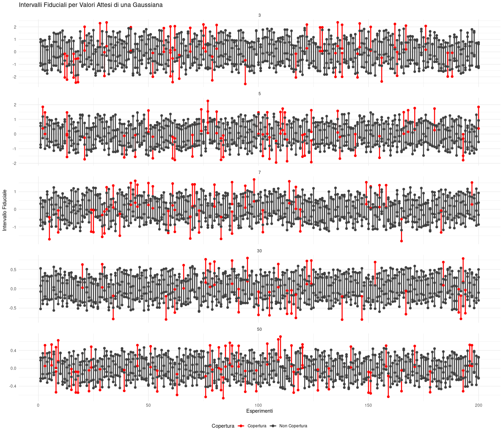
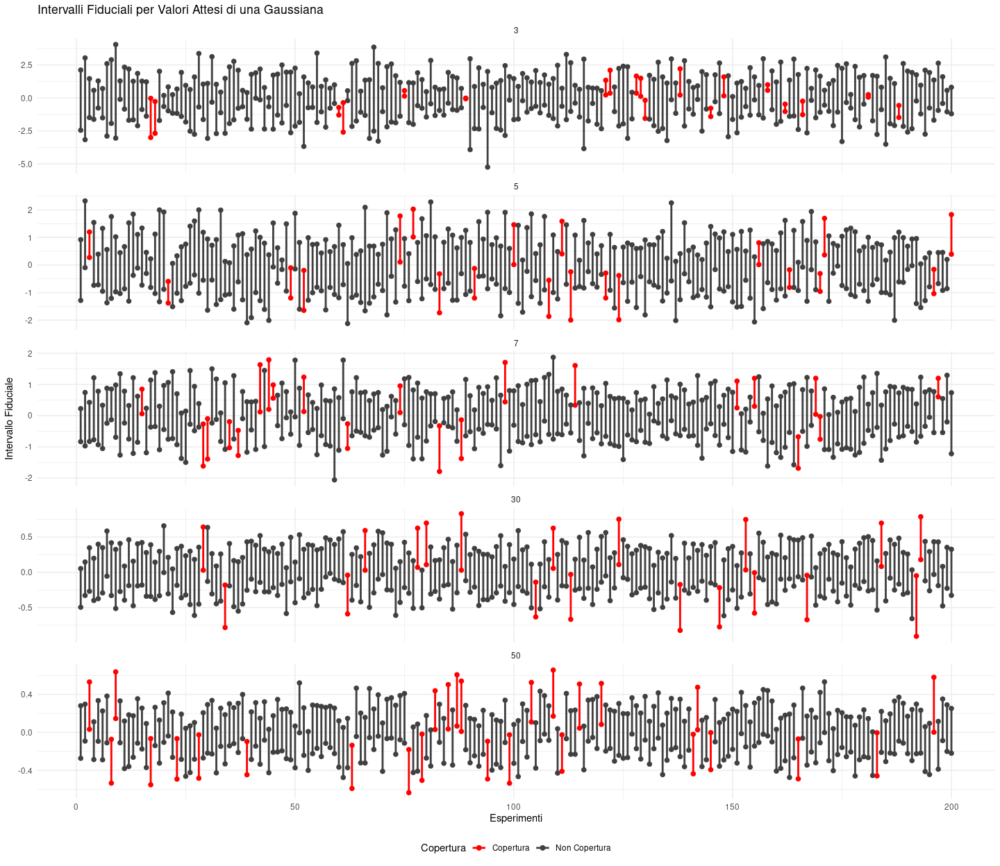

# Esercizio 1

Studiare la copertuta dell’intervallo fiduciario al variare della
numerosità campionaria *n* = 3, 5, 7, 30, 50. Discutere, aiutandosi con
un grafico, dei risultati.

    library(ggplot2)

    alfaNominale <- 0.10
    coperturaNominale <- 1 - alfaNominale
    pctZ <- qnorm(1 - alfaNominale / 2)
    muZero  <- 0
    sigmaZero <- 1
    numeroRepliche <- 200

    risultati <- data.frame(n = integer(), limiteInf = numeric(), limiteSup = numeric(), esperimento = integer(), copertura = integer())

Ho leggermente modificato il ciclo in modo tale da andare a ciclare
anche il vettore esterno numero di ripetizioni che va a variare

    set.seed(20191025)
    for (n in c(3, 5, 7, 30, 50)) {
        coperturaEmpirica <- rep(0, numeroRepliche)  

        for (r in 1:numeroRepliche) {
            campione <- rnorm(n, mean = muZero, sd = sigmaZero)
            media <- mean(campione)
            limiteInf <- media - pctZ * sigmaZero / sqrt(n)
            limiteSup <- media + pctZ * sigmaZero / sqrt(n)
            

            copertura <- ifelse(muZero > limiteInf & muZero < limiteSup, 1, 0)
            coperturaEmpirica[r] <- copertura

            risultati <- rbind(risultati, data.frame(n = n, limiteInf = limiteInf, limiteSup = limiteSup, esperimento = r, copertura = copertura))
        }

        
        numCopertura <- sum(coperturaEmpirica)
        coperturaEmpiricaMedia <- mean(coperturaEmpirica)
        message("Per n = ", n, ", l'intervallo fiduciario contiene il valore atteso della popolazione ", numCopertura, " volte su ", numeroRepliche, 
                ", il che corrisponde a una copertura empirica di ", round(coperturaEmpiricaMedia * 100, 2), "%.")

        # Calcolo p-value
        zc <- abs(coperturaEmpiricaMedia - coperturaNominale)
        zc <- zc / sqrt(coperturaNominale * (1 - coperturaNominale) / numeroRepliche)
        p_value <- round(2 * pnorm(zc, lower.tail = FALSE), 4)
        
        message("Per n = ", n, ", il p-value è ", p_value, ".")
    }

    ## Per n = 3, l'intervallo fiduciario contiene il valore atteso della popolazione 181 volte su 200, il che corrisponde a una copertura empirica di 90.5%.

    ## Per n = 3, il p-value è 0.8137.

    ## Per n = 5, l'intervallo fiduciario contiene il valore atteso della popolazione 172 volte su 200, il che corrisponde a una copertura empirica di 86%.

    ## Per n = 5, il p-value è 0.0593.

    ## Per n = 7, l'intervallo fiduciario contiene il valore atteso della popolazione 179 volte su 200, il che corrisponde a una copertura empirica di 89.5%.

    ## Per n = 7, il p-value è 0.8137.

    ## Per n = 30, l'intervallo fiduciario contiene il valore atteso della popolazione 180 volte su 200, il che corrisponde a una copertura empirica di 90%.

    ## Per n = 30, il p-value è 1.

    ## Per n = 50, l'intervallo fiduciario contiene il valore atteso della popolazione 175 volte su 200, il che corrisponde a una copertura empirica di 87.5%.

    ## Per n = 50, il p-value è 0.2386.

Per completezza vado a testare i miei risultati in presenza di un seed
diverso

    set.seed(1234)

    for (n in c(3, 5, 7, 30, 50)) {
        coperturaEmpirica <- rep(0, numeroRepliche)

        for (r in 1:numeroRepliche) {
            campione <- rnorm(n, mean = muZero, sd = sigmaZero)
            media <- mean(campione)
            limiteInf <- media - pctZ * sigmaZero / sqrt(n)
            limiteSup <- media + pctZ * sigmaZero / sqrt(n)
            

            copertura <- ifelse(muZero > limiteInf & muZero < limiteSup, 1, 0)
            coperturaEmpirica[r] <- copertura

            risultati <- rbind(risultati, data.frame(n = n, limiteInf = limiteInf, limiteSup = limiteSup, esperimento = r, copertura = copertura))
        }

        
        numCopertura <- sum(coperturaEmpirica)
        coperturaEmpiricaMedia <- mean(coperturaEmpirica)
        message("Per n = ", n, ", l'intervallo fiduciario contiene il valore atteso della popolazione ", numCopertura, " volte su ", numeroRepliche, 
                ", il che corrisponde a una copertura empirica di ", round(coperturaEmpiricaMedia * 100, 2), "%.")

        # Calcolo p-value
        zc <- abs(coperturaEmpiricaMedia - coperturaNominale)
        zc <- zc / sqrt(coperturaNominale * (1 - coperturaNominale) / numeroRepliche)
        p_value <- round(2 * pnorm(zc, lower.tail = FALSE), 4)
        
        message("Per n = ", n, ", il p-value è ", p_value, ".")
    }

    ## Per n = 3, l'intervallo fiduciario contiene il valore atteso della popolazione 178 volte su 200, il che corrisponde a una copertura empirica di 89%.

    ## Per n = 3, il p-value è 0.6374.

    ## Per n = 5, l'intervallo fiduciario contiene il valore atteso della popolazione 186 volte su 200, il che corrisponde a una copertura empirica di 93%.

    ## Per n = 5, il p-value è 0.1573.

    ## Per n = 7, l'intervallo fiduciario contiene il valore atteso della popolazione 183 volte su 200, il che corrisponde a una copertura empirica di 91.5%.

    ## Per n = 7, il p-value è 0.4795.

    ## Per n = 30, l'intervallo fiduciario contiene il valore atteso della popolazione 191 volte su 200, il che corrisponde a una copertura empirica di 95.5%.

    ## Per n = 30, il p-value è 0.0095.

    ## Per n = 50, l'intervallo fiduciario contiene il valore atteso della popolazione 176 volte su 200, il che corrisponde a una copertura empirica di 88%.

    ## Per n = 50, il p-value è 0.3458.

    ggplot(risultati, aes(x = esperimento)) +
        geom_segment(aes(xend = esperimento, y = limiteInf, yend = limiteSup, color = factor(copertura)), size = 1) +
        geom_point(aes(y = limiteInf, color = factor(copertura)), size = 2) +
        geom_point(aes(y = limiteSup, color = factor(copertura)), size = 2) +
        facet_wrap(~ n, scales = "free_y", ncol = 1) +  # Creazione di un pannello per ogni n
        labs(title = "Intervalli Fiduciali per Valori Attesi di una Gaussiana",
             x = "Esperimenti",
             y = "Intervallo Fiduciale",
             color = "Copertura") +
        scale_color_manual(values = c("1" = "gray25", "0" = "red"), labels = c("Copertura", "Non Copertura")) +
        theme_minimal() +
        theme(legend.position = "bottom")

    ## Warning: Using `size` aesthetic for lines was deprecated in ggplot2 3.4.0.
    ## ℹ Please use `linewidth` instead.
    ## This warning is displayed once every 8 hours.
    ## Call `lifecycle::last_lifecycle_warnings()` to see where this warning was
    ## generated.

## Interpretazione dei risultati

Riguardo la copertura empirica si nota come da *n* = 5 la copertura
tende ad oscillare intorno al valore soglia del 90%. Embelmatico il caso
di *n* = 30 per cui la copertura essendo esattamente al 90% porta ad
avere anche un pvalue pari a 1.

In proposito proprio del pvalue si nota che per ogni numerosità, le
deviazioni dalla copertura nominale, dato *H*0 = 90%, non
siano statisticamente significative. Per *n* = 5 abbiamo l’unico pvalue
basso ma comunque accettabile.

Andando a cambiare seed si nota come le coperture cambino. In
particolare per *n* = 30 si ha la copertura più alta pari al 95%,
risultato che si riflette anche nel pvalue basso, che sta ad indicare
differenze significative nella copertura.

# Esercizio 2

Assumendo che la varianza della popolazione sia non nota, ripetere
l’esercizio (1).

Visto che la varianza è non nota utilizzo la distribuzione t di Student
invece della normale

    set.seed(20191025)

    alfaNominale_t <- 0.10
    coperturaNominale_t <- 1 - alfaNominale
    n_values_t <- c(3, 5, 7, 30, 50)  # dimensioni campionarie
    numeroRepliche_t <- 200
    results_t <- list()  # lista per memorizzare i risultati

    # Ciclo per le diverse dimensioni campionarie
    for (n in n_values_t) {
      coperturaEmpirica_t <- rep(0, numeroRepliche_t)
      limiteInf_t <- rep(0, numeroRepliche_t)
      limiteSup_t <- rep(0, numeroRepliche_t)

      for (r in 1:numeroRepliche_t) {
        campione_t <- rnorm(n, mean = 0, sd = 1)
        media_t <- mean(campione_t)
        s_t <- sd(campione_t)  
        df_t <- n - 1
        pctT <- qt(1 - alfaNominale_t / 2, df_t)  

        limiteInf_t[r] <- media_t - pctT * s_t / sqrt(n)
        limiteSup_t[r] <- media_t + pctT * s_t / sqrt(n)

        if (0 > limiteInf_t[r] & 0 < limiteSup_t[r]) {
          coperturaEmpirica_t[r] <- 1
        }
      }
      
        results_t <- rbind(results_t, data.frame(
        n = n,
        esperimento = 1:numeroRepliche_t,
        limiteInf = limiteInf_t,
        limiteSup = limiteSup_t,
        copertura = coperturaEmpirica_t
      ))

      copertura_empirica_media_t <- mean(coperturaEmpirica_t)
      p_value_t <- abs(copertura_empirica_media_t - coperturaNominale_t) / 
                 sqrt(coperturaNominale_t * (1 - coperturaNominale_t) / numeroRepliche_t)
      p_value_t <- round(2 * pnorm(p_value_t, lower.tail = FALSE), 4)

      message("Per n = ", n, ", l'intervallo fiduciario contiene il valore atteso della popolazione ", 
              sum(coperturaEmpirica_t), " volte su ", numeroRepliche_t, ".")
      message("Copertura empirica: ", round(copertura_empirica_media_t * 100, 2), "%.")
      message("Il p-value è ", p_value_t, ".\n")
    }

    ## Per n = 3, l'intervallo fiduciario contiene il valore atteso della popolazione 181 volte su 200.

    ## Copertura empirica: 90.5%.

    ## Il p-value è 0.8137.

    ## Per n = 5, l'intervallo fiduciario contiene il valore atteso della popolazione 180 volte su 200.

    ## Copertura empirica: 90%.

    ## Il p-value è 1.

    ## Per n = 7, l'intervallo fiduciario contiene il valore atteso della popolazione 179 volte su 200.

    ## Copertura empirica: 89.5%.

    ## Il p-value è 0.8137.

    ## Per n = 30, l'intervallo fiduciario contiene il valore atteso della popolazione 181 volte su 200.

    ## Copertura empirica: 90.5%.

    ## Il p-value è 0.8137.

    ## Per n = 50, l'intervallo fiduciario contiene il valore atteso della popolazione 173 volte su 200.

    ## Copertura empirica: 86.5%.

    ## Il p-value è 0.099.

    ggplot(results_t, aes(x = esperimento)) +
      geom_segment(aes(xend = esperimento, y = limiteInf, yend = limiteSup, color = factor(copertura)), size = 1) +
      geom_point(aes(y = limiteInf, color = factor(copertura)), size = 2) +
      geom_point(aes(y = limiteSup, color = factor(copertura)), size = 2) +
      facet_wrap(~ n, scales = "free_y", ncol = 1) +  # Creazione di un pannello per ogni n
      labs(title = "Intervalli Fiduciali per Valori Attesi di una Gaussiana",
           x = "Esperimenti",
           y = "Intervallo Fiduciale",
           color = "Copertura") +
      scale_color_manual(values = c("1" = "gray25", "0" = "red"), labels = c("Copertura", "Non Copertura")) +
      theme_minimal() +
      theme(legend.position = "bottom")

## Interpretazione dei risultati

In questo caso con la varianza ignota la copertura empirica si comporta
in modo controintuitivo, essendo superiore al 90% per numerosità
campionarie piccole (5, 7, 30) o addirittura pari al 100% per *n* = 3 e
inferiore di molto per *n* = 50, cosa che si riflette nei pvalue in cui
quello per 50 è molto basso (inferiore al 10%).

# Esercizio 3

Considerando un popolazione di Cauchy, ripetere l’esercizio (2).

    set.seed(20191025)

    alfaNominale_c <- 0.10
    coperturaNominale_c <- 1 - alfaNominale_t
    n_values_c <- c(3, 5, 7, 30, 50)  # dimensioni campionarie
    numeroRepliche_c <- 200
    results_c <- data.frame()  # dataframe per memorizzare i risultati

    # Ciclo per le diverse dimensioni campionarie
    for (n in n_values_c) {
      coperturaEmpirica_c <- rep(0, numeroRepliche_c)
      limiteInf_c <- rep(0, numeroRepliche_c)
      limiteSup_c <- rep(0, numeroRepliche_c)

      for (r in 1:numeroRepliche_c) {
        campione_c <- rcauchy(n)  # Genera un campione da una distribuzione di Cauchy
        mediana_c <- median(campione_c)
        q1_c <- quantile(campione_c, 0.05)  
        q2_c <- quantile(campione_c, 0.95)  

        limiteInf_c[r] <- mediana_c - (q2_c - q1_c) / 2
        limiteSup_c[r] <- mediana_c + (q2_c - q1_c) / 2

        if (0 > limiteInf_c[r] & 0 < limiteSup_c[r]) {
          coperturaEmpirica_c[r] <- 1
        }
      }

      results_c <- rbind(results_c, data.frame(
        n = n,
        esperimento_c = 1:numeroRepliche_c,
        limiteInf_c = limiteInf_c,
        limiteSup_c = limiteSup_c,
        copertura_c = coperturaEmpirica_c
      ))

      copertura_empirica_media_c <- mean(coperturaEmpirica_c)
      p_value_c <- abs(copertura_empirica_media_c - coperturaNominale_c) / 
                 sqrt(coperturaNominale_c * (1 - coperturaNominale_c) / numeroRepliche_c)
      p_value_c <- round(2 * pnorm(p_value_c, lower.tail = FALSE), 4)

      message("Per n = ", n, ", l'intervallo fiduciano contiene il valore atteso della popolazione ", 
              sum(coperturaEmpirica_c), " volte su ", numeroRepliche_c, ".")
      message("Copertura empirica: ", round(copertura_empirica_media_c * 100, 2), "%.")
      message("Il p-value è ", p_value_c, ".\n")
    }

    ## Per n = 3, l'intervallo fiduciano contiene il valore atteso della popolazione 153 volte su 200.

    ## Copertura empirica: 76.5%.

    ## Il p-value è 0.

    ## Per n = 5, l'intervallo fiduciano contiene il valore atteso della popolazione 190 volte su 200.

    ## Copertura empirica: 95%.

    ## Il p-value è 0.0184.

    ## Per n = 7, l'intervallo fiduciano contiene il valore atteso della popolazione 197 volte su 200.

    ## Copertura empirica: 98.5%.

    ## Il p-value è 1e-04.

    ## Per n = 30, l'intervallo fiduciano contiene il valore atteso della popolazione 200 volte su 200.

    ## Copertura empirica: 100%.

    ## Il p-value è 0.

    ## Per n = 50, l'intervallo fiduciano contiene il valore atteso della popolazione 200 volte su 200.

    ## Copertura empirica: 100%.

    ## Il p-value è 0.

    ggplot(results_c, aes(x = esperimento_c)) +
      geom_segment(aes(xend = esperimento_c, y = limiteInf_c, yend = limiteSup_c, color = factor(copertura_c)), size = 1) +
      geom_point(aes(y = limiteInf_c, color = factor(copertura_c)), size = 2) +
      geom_point(aes(y = limiteSup_c, color = factor(copertura_c)), size = 2) +
      facet_wrap(~ n, scales = "free_y", ncol = 1) +  # Creazione di un pannello per ogni n
      labs(title = "Intervalli Fiduciali per Valori Attesi di una Distribuzione di Cauchy",
           x = "Esperimenti",
           y = "Intervallo Fiduciale",
           color = "Copertura") +
      scale_color_manual(values = c("1" = "gray25", "0" = "red"), labels = c("Copertura", "Non Copertura")) +
      theme_minimal() +
      theme(legend.position = "bottom")

## Interpretazione dei risultati

In questo caso, lavorando con una popolazione di Cauchy che ha delle
proprietà particolari avendo sia valore atteso che varianza indefinite e
con code pesanti, si osserva come per numerosità campionaria pari a 3
l’intervallo fiduciario non è molto affidabile. Aumentando la numerosità
però l’intervallo tende ad avere una copertura molto alta fino ad
arrivare al 100% per *n* = 30 *e* 50.

# Algoritmo di Marsaglia

Siano *U*1 e *U*2 due variabili casuali
indipendenti uniformi su supporto \[−1;1\]

La variabile *U*2 è anch’essa uniformemente distribuita tra
 − 1 *e* 1 poichè somma di
*U*12 *e* *U*22.

L’idea è quella di usare **R** e *Ω* per ottenere coordinate normalmente
distribuite.
 **R**$=\sqrt{U\_{1}^{2}+U\_{2}^{2}}$ $\Omega = \tan^{-1}\left(\dfrac{U\_{2}}{U\_{1}}\right)$ **R**
rappresenta il raggio del piano polare.

Per arrivare alla distribuzione normale si calcolano X e Y in questo
modo: *X* = *R*cos (*Ω*) *Y* = *R*sin (*Ω*)

Si va a definire **R** come $\sqrt{-2\ln(U\_{1})}$. *U*1 è
una variabile casuale uniforme. Si va a trasformarla in **R** attraverso
il logaritmo naturale e la funzione esponenziale. Se *U*1
segue una distribuzione uniforme allora
 − ln (*U*1) ∼ *E**x**p*(*λ*=1) **X** e **Y** quindi vengono
definiti
come $X=\sqrt{-2\ln(U^{2})}\cdot\cos(\Omega) =\sqrt{-2\ln(U^{2})}\cdot U\_{1}$ $Y=\sqrt{-2\ln(U^{2})}\cdot\sin(\Omega) =\sqrt{-2\ln(U^{2})}\cdot U\_{2}$

Sia **X** che **Y** seguono una distribuzione normale

## Dimostrazione

Sia **U** una v.c. unifromemente distribuita in (0,1). La densità di
probabilità
$f\_{U}(u) = \begin{cases} 1\\ &se\\ 0&lt;u&lt;1\\\\ 0\\ &altrimenti \end{cases}$

Consideriamo *V* =  − ln (*U*). Determiniamo la distribuzione di
**V** *F**V*(*v*) = ℙ(*V*≤*v*) = ℙ(−ln(*U*)≤*v*) = ℙ(*U*≥*e*−*v*) Visto
che **U** è uniformemente distribuita su (0,1) si ha
che: ℙ(*U*≥*e*−*v*) = 1 − ℙ(*U*&lt;*e*−*v*) = 1 − *e*−*v* Da
cui si ha
che: $F\_{V}(v) = \begin{cases}0\\ &se\\ v&lt;0\\\\ 1-e^{-v}\\ &se\\ v\ge 0 \end{cases}$ $f\_{V}(v) = \dfrac{d}{dv}F\_{V}(v) = \begin{cases} 0\\ &se\\ v&lt;0\\\\ e^{-v}\\ &se\\ v\ge 0 \end{cases}$ Quindi
**V** segue una distribuzione esponenziale con parametro *λ* = 1.

Tornando all’algoritmo di Marsaglia abbiamo che
*R*2 =  − 2ln (*U*2). La variabile
 − 2ln (*U*2) è una variabile esponenziale di parametro
*λ* = 2 perche moltiplicato per due. *R*2 invece segue una
distribuzoine *χ*2 con 2 gradi di libertà, che p equivalente
ad una distribuzione esponenziale. La radice quadrata di *R*2
quindi rappresenta una distribuzione normale.
